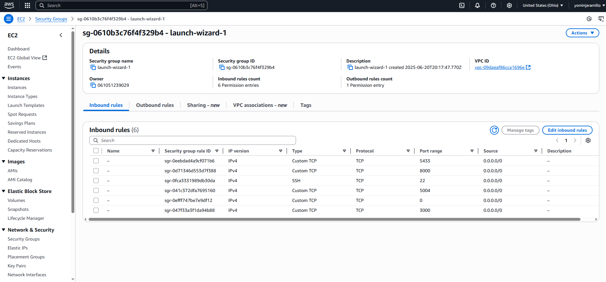
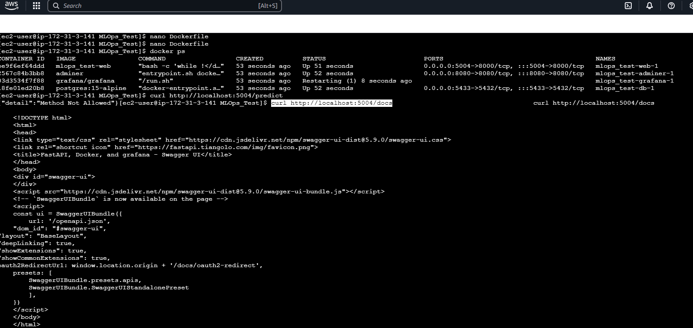
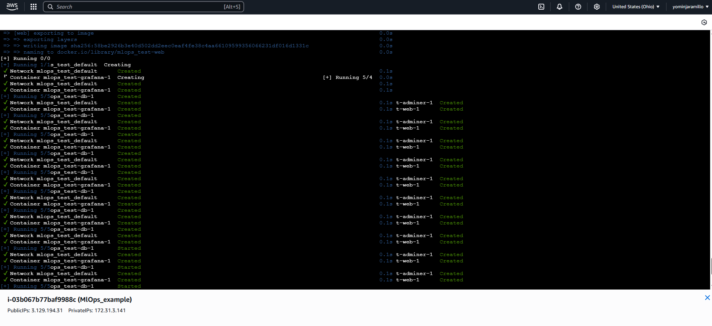
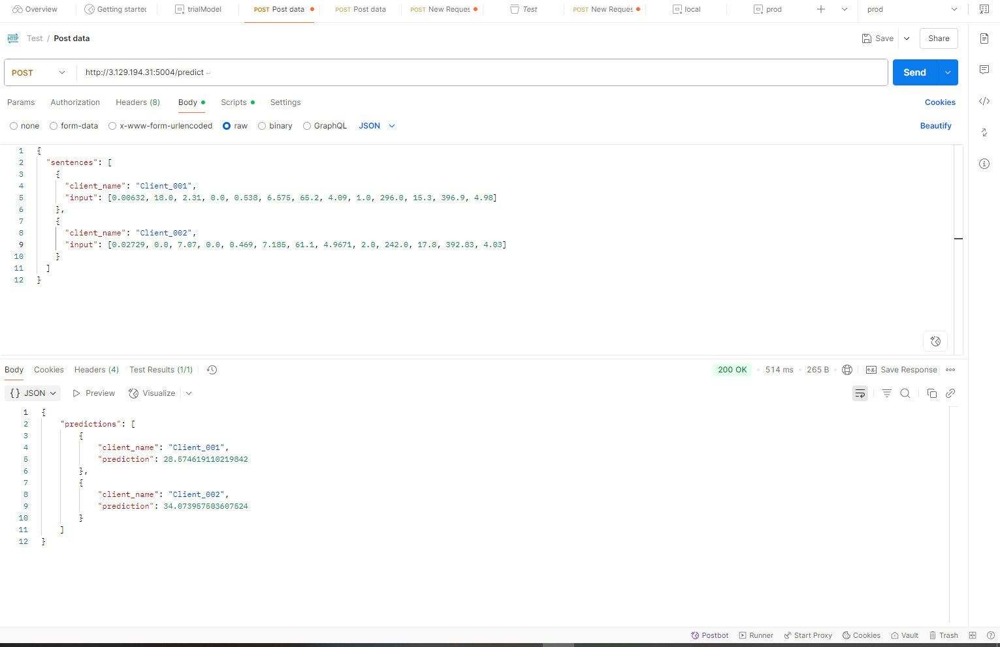

# Documentación del Despliegue de un Modelo de Machine Learning en Producción usando AWS EC2, Docker y FastAPI

## 🌐 Descripción General

Este documento describe paso a paso el proceso de despliegue de un modelo de Machine Learning en un entorno de producción usando:

- Una instancia EC2 de AWS
- Docker y Docker Compose
- FastAPI como framework web
- PostgreSQL como base de datos

## 🚀 Tecnologías Utilizadas

| Tecnología     | Propósito                                |
| -------------- | ---------------------------------------- |
| AWS EC2        | Servidor en la nube                      |
| Docker         | Empaquetar la aplicación en contenedores |
| Docker Compose | Orquestar múltiples contenedores         |
| FastAPI        | Framework web para servir el modelo      |
| PostgreSQL     | Base de datos relacional                 |
| Adminer        | UI para gestionar PostgreSQL             |
| Grafana        | Visualización de métricas                |

## 🏢 Arquitectura

La aplicación se estructura en múltiples servicios Docker:

- `web`: contiene la aplicación FastAPI y el modelo entrenado
- `db`: base de datos PostgreSQL
- `adminer`: UI para acceder a la base de datos 
- `grafana`: visualización de métricas - no implementado aún

## ⚖️ Estructura del Proyecto

```
MLOps_Test/
├── app/
│   ├── main.py
│   ├── prestart.sh
│   └── ...
├── requirements.txt
├── Dockerfile
├── docker-compose.yml
```

## ✍️ Paso a Paso

### 1. Crear instancia EC2

- Tipo: Amazon Linux o Ubuntu
- Habilitar puertos 22 (SSH), 5004 (API), 5433 (Postgres), 8080 (Adminer), 3000 (Grafana)
- Esto debe ser realizado en el GroupSecurity de la instancia EC2
  

### 2. Instalar Docker y Docker Compose

```bash
sudo apt update && sudo apt install docker.io docker-compose -y
sudo usermod -aG docker ${USER}
sudo systemctl start docker
```

### 3. Subir el proyecto a GitHub y clonarlo en la EC2

```bash
git clone https://github.com/YominJaramilloM/MLOps_Test.git
cd MLOps_Test
```

### 4. Construir y levantar los contenedores

```bash
docker-compose up --build -d
```

### 5. Verificar servicios en ejecución

```bash
docker ps
```

### 6. Probar localmente desde la EC2

```bash
curl http://localhost:5004/docs
```

### 7. Probar desde navegador/Postman

```
http://<IP_PUBLICA_EC2>:5004/predict
```
En este caso la IP publica desplegada fue 
```
http://3.129.194.31:5004/predict
```
para prod



## JSON de prueba
```
{
  "sentences": [
    {
      "client_name": "Client_001",
      "input": [0.00632, 18.0, 2.31, 0.0, 0.538, 6.575, 65.2, 4.09, 1.0, 296.0, 15.3, 396.9, 4.98]
    },
    {
      "client_name": "Client_002",
      "input": [0.02729, 0.0, 7.07, 0.0, 0.469, 7.185, 61.1, 4.9671, 2.0, 242.0, 17.8, 392.83, 4.03]
    }
  ]
}
```
## 📁 Dockerfile

Define la imagen base, instala dependencias, y establece el punto de entrada:

```dockerfile
FROM python:3.11.1-slim
WORKDIR /app
ENV PYTHONDONTWRITEBYTECODE 1
ENV PYTHONUNBUFFERED 1
COPY requirements.txt .
RUN pip install --no-cache-dir -r requirements.txt
COPY . .
RUN chmod +x /app/app/prestart.sh
CMD ["/app/app/prestart.sh", "uvicorn", "app.main:app", "--host", "0.0.0.0", "--port", "8000"]
```

## 🛀 docker-compose.yml

Orquesta los servicios:

```yaml
services:
  web:
    build: .
    command: bash -c 'while !</dev/tcp/db/5432; do sleep 1; done; uvicorn app.main:app --host 0.0.0.0 --port 8000 --reload'
    ports:
      - "5004:8000"
    environment:
      - DATABASE_URL=postgresql://fastapi_traefik:fastapi_traefik@db:5432/fastapi_traefik
    depends_on:
      - db

  db:
    image: postgres:15-alpine
    ports:
      - "5433:5432"
    environment:
      - POSTGRES_USER=fastapi_traefik
      - POSTGRES_PASSWORD=fastapi_traefik
      - POSTGRES_DB=fastapi_traefik

  adminer:
    image: adminer
    ports:
      - "8080:8080"
```

## 🔧 Prestart.sh

Espera a que PostgreSQL esté listo antes de iniciar FastAPI:

```bash
#!/bin/bash

echo "Waiting for postgres connection"

while ! nc -z db 5432; do
    sleep 0.1
done

echo "PostgreSQL started"
exec "$@"
```

## 🔍 Verificación Final

- Swagger: `http://<IP_EC2>:5004/docs`
- Postman: `POST http://<IP_EC2>:5004/predict` con el JSON de prueba

## 🎉 Resultado

Tu modelo ya está desplegado y accesible desde Internet con Docker en una instancia EC2.

---

Si deseas agregar monitoreo, autenticación o escalabilidad, esto puede extenderse. Pero esta es una base sólida para producción MVP.

---

✉️ **Creado por Yomin Jaramillo M. para fines educativos y de desarrollo profesional.**


